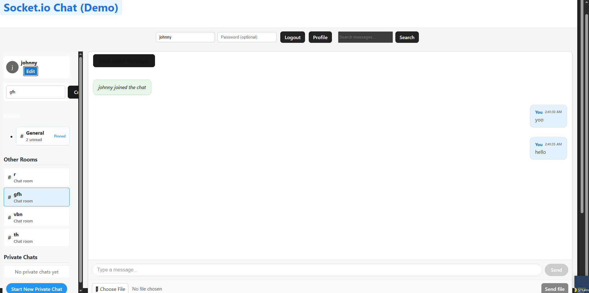

# Real-Time Chat Application with Socket.io

This assignment focuses on building a real-time chat application using Socket.io, implementing bidirectional communication between clients and server.

## Assignment Overview

You will build a chat application with the following features:
1. Real-time messaging using Socket.io
2. User authentication and presence
3. Multiple chat rooms or private messaging
4. Real-time notifications
5. Advanced features like typing indicators and read receipts

## Project Structure

```
socketio-chat/
├── client/                 # React front-end
│   ├── public/             # Static files
│   ├── src/                # React source code
│   │   ├── components/     # UI components
│   │   ├── context/        # React context providers
│   │   ├── hooks/          # Custom React hooks
│   │   ├── pages/          # Page components
│   │   ├── socket/         # Socket.io client setup
│   │   └── App.jsx         # Main application component
│   └── package.json        # Client dependencies
# Real-time Communication with Socket.io (Demo)

This repository contains a real-time chat application built using the MERN stack and Socket.io. It was created as part of a development assignment and demonstrates a number of real-time and UX features.

Top-level structure

- `client/` — React (Vite) front-end
- `server/` — Express + Socket.io back-end
- `screenshots/` — example screenshots used in this README

## Project overview

The application demonstrates:

- Real-time messaging (rooms and private messages) using Socket.io
- Message persistence in MongoDB (Mongoose models)
- Message pagination (load older messages) and search
- File sharing (upload / inline image preview)
- Typing indicators, online user list and presence updates
- Delivery acknowledgments (ACKs) and optimistic UI updates
- Mobile responsive layout and accessibility improvements

## Features implemented

- Real-time room chat
- Private/direct messaging
- Message persistence (MongoDB)
- Pagination for older messages
- Message delivery ACKs
- Optimistic UI for outgoing messages
- Typing indicators and presence (online users)
- File upload and inline image preview (images as base64)
- Search endpoint and client-side search UI
- Reconnection handling and Socket.io performance tuning
- Responsive styles for mobile

---

## Prerequisites

- Node.js (v16+ recommended)
- npm (or yarn)
- MongoDB (Atlas or local)

---

## Environment variables

Create `.env` files for server and client. Do NOT commit these files.

server/.env (example)

```
MONGODB_URI=mongodb+srv://<user>:<password>@cluster0.mongodb.net/chat?retryWrites=true&w=majority
PORT=5000
JWT_SECRET=your_jwt_secret_here
```

client/.env (Vite requires `VITE_` prefix)

```
VITE_API_URL=http://localhost:5000
VITE_SOCKET_URL=http://localhost:5000
```

Replace values with your own. Make sure `.gitignore` contains `.env` entries (this project already includes them).

---

## Local development (Windows PowerShell)

Open two terminals (server and client). From repo root:

Server

```powershell
cd server
npm install
# start server (or `npm run dev` if you have nodemon configured)
npm start
```

Client

```powershell
cd client
npm install
npm run dev
# Vite typically serves at http://localhost:5173
```

If you change ports, update `client/.env` (and restart Vite).

---

## API (selected)

- `GET /api/messages?page=1&limit=50` — fetch paginated room messages (requires auth)
- `GET /api/messages/private/:otherId?page=1&limit=50` — fetch private conversation
- `POST /api/auth/login` — login (returns JWT)
- `POST /api/upload` — file upload (if enabled server-side)

Socket events (selected)

- `send_message` — client -> server (uses ACK to confirm persistence)
- `receive_message` — server -> client
- `private_message`, `typing`, `user_list`, `user_joined`, `user_updated`, etc.

---

## Screenshots

Example screenshots are in the `screenshots/` folder. Add your own screenshots or GIFs there and reference them below.

- `screenshots/general.png` — overall layout
- `screenshots/romms.png` — sidebar and rooms
- `screenshots/edit profile.png` — profile

You can embed images in this README using relative links, for example:

```md

```

---

## Troubleshooting

- Messages not appearing: ensure the server saved the message to MongoDB and that the message payload contains `content` (the client supports `content`, `message`, or `body`).
- Socket connection issues: verify `VITE_SOCKET_URL` and server CORS/socket origins.
- Env variables not loaded: restart the dev servers after editing `.env`.

If you want me to add quick debugging helpers, I can temporarily log incoming socket message objects on the client to inspect their shape.

---

## Next steps / optional improvements

- Add tests for the message API endpoints
- Add server-side file storage (S3 or similar) instead of base64 in MongoDB
- Add E2E tests (Cypress) for the chat flow
- Add Docker Compose for local development with MongoDB

---

If you'd like, I can update this README to include automated run scripts, a CONTRIBUTING guide, or generate a short GIF showing message send/receive and pagination.

